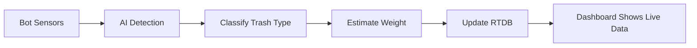

# Trash Collection Data Flow

## Overview

This document explains how trash collection data is stored, tracked, and displayed across the AGOS app.

---

## Data Storage Locations

### 1. Firebase Realtime Database (RTDB) - Live Data

**Path**: `/bots/{bot_id}`

```json
{
  "trash_collected": 8.5,          // Total weight in kg (live)
  "current_load": 8.5,              // Current bot load in kg
  "trash_by_type": {                // Live trash breakdown
    "plastic": 5,
    "metal": 2,
    "paper": 3,
    "glass": 1,
    "organic": 4
  },
  "trash_collection": [             // Array of individual items
    {
      "type": "plastic",
      "weight_kg": 0.5,
      "timestamp": 1733097600000,
      "confidence": 0.95,
      "lat": 14.5995,
      "lng": 120.9842
    }
  ]
}
```

**Purpose**: Real-time tracking during active deployments
- **Updated by**: Hardware (bot sensors/AI) via IoT
- **Frequency**: Continuous updates as trash is collected
- **Scope**: Current deployment only

---

### 2. Firestore - Historical Data

**Collection**: `deployments`

```json
{
  "schedule_id": "sched_123",
  "bot_id": "AGOS-BOT-12345",
  "river_id": "river_456",
  "status": "completed",
  "trash_collection": {             // Aggregated on completion
    "t_otalweight": 8.5,
    "total_items": 15,
    "trash_by_type": {
      "plastic": 5,
      "metal": 2,
      "paper": 3,
      "glass": 1,
      "organic": 4
    }
  },
  "water_quality": {
    "avg_ph_level": 7.2,
    "avg_turbidity": 15.5,
    "avg_temperature": 28.5,
    "avg_dissolved_oxygen": 6.8,
    "sample_count": 120
  },
  "created_at": "2024-12-01T10:00:00Z",
  "actual_start_time": "2024-12-01T10:15:00Z",
  "actual_end_time": "2024-12-01T12:45:00Z"
}
```

**Purpose**: Permanent historical records
- **Created when**: Deployment is completed/recalled
- **Updated by**: `schedule_service.dart`'s `completeSchedule()` method
- **Source**: Snapshots data from RTDB at completion time
- **Scope**: All completed deployments

---

## How Trash Data is Collected

### Step 1: Bot Deployment (Hardware Side)



1. **Detection**: Onboard cameras and sensors detect trash
2. **Classification**: AI model classifies trash type (plastic, metal, etc.)
3. **Weighing**: Load cell sensors measure weight
4. **Upload**: Data is sent to Firebase RTDB in real-time

### Step 2: Live Tracking (Mobile App)

**Dashboard**: `lib/features/dashboard/pages/dashboard_page.dart`

```dart
// Listens to RTDB for live updates
final botSnapshot = await FirebaseDatabase.instance
    .ref('bots/$botId')
    .get();

final currentLoad = botData['current_load'] ?? 0.0;
final trashCollected = botData['trash_collected'] ?? 0.0;
```

- **Updates every**: 3 seconds (polling)
- **Shows**: Current load, trash by type, total collected
- **Cards**: Live river deployment cards

### Step 3: Deployment Completion

**Service**: `lib/core/services/schedule_service.dart`

```dart
Future<void> completeSchedule(String scheduleId) async {
  // 1. Get final data from RTDB
  final rtdb = FirebaseDatabase.instance.ref();
  final botSnap = await rtdb.child('bots/${schedule.botId}').get();
  final data = Map<String, dynamic>.from(botSnap.value as Map);
  
  // 2. Create trash summary
  final trashKg = (data['trash_collected'] as num?)?.toDouble() ?? 0.0;
  Map<String, int> trashByType = {};
  if (data['trash_by_type'] is Map) {
    final trashTypesData = Map<String, dynamic>.from(data['trash_by_type'] as Map);
    trashTypesData.forEach((key, value) {
      trashByType[key] = (value is num) ? value.toInt() : 0;
    });
  }
  
  final trashSummary = TrashCollectionSummary(
    trashByType: trashByType,
    totalWeight: trashKg,
    totalItems: totalItems,
  );
  
  // 3. Save to Firestore deployments collection
  await deploymentService.completeDeployment(
    deploymentId,
    trashCollection: trashSummary,
    // ... other data
  );
  
  // 4. Update river statistics
  await _updateRiverStatistics(schedule.riverId, trashKg);
}
```

---

## Where Trash Data is Displayed

### 1. Dashboard - Live River Deployments

**Shows**: Real-time data from RTDB
- **Current Load**: `bots/{bot_id}/current_load`
- **Total Today (River)**: Aggregated from completed deployments in Firestore for that river today

```dart
// Dashboard Provider
final riverTotalToday = await _getRiverTotalToday(schedule.riverId);
// This queries Firestore deployments for river_id + today's date
```

**Why it might show 0**: 
- No trash has been collected yet in this deployment
- Hardware hasn't updated RTDB yet
- Bot is still in scheduled/idle status

### 2. Rivers Management

**Shows**: Historical totals from Firestore `rivers` collection
- **Total Trash Collected**: Sum of all completed deployments
- **Updated when**: Deployment completes (via `_updateRiverStatistics()`)

```dart
// Rivers Collection
{
  "total_deployments": 15,
  "total_trash_collected": 45.2,  // kg
  "last_deployment": "2024-12-01T12:45:00Z"
}
```

**Why it might show 0**:
- No deployments have been completed yet for this river
- Need to run the backfill utility (refresh button on rivers page)

### 3. Deployment History

**Shows**: Historical data from Firestore `deployments` collection
- **Trash Collected**: `deployment.trashCollection.totalWeight`
- **Items**: `deployment.trashCollection.totalItems`
- **By Type**: `deployment.trashCollection.trashByType`

**Why it might show 0**:
- Deployment hasn't completed yet
- Deployment was cancelled before collecting trash
- Hardware didn't report any trash

### 4. Deployment Details Page

**Shows**: Comprehensive breakdown from Firestore
- Total weight and items
- Breakdown by trash type with colored chips
- Individual metrics and timeline

---

## Common Scenarios

### Scenario 1: Active Deployment

**RTDB**: ✅ Live data updating
```json
{
  "trash_collected": 3.5,
  "current_load": 3.5
}
```

**Firestore Deployments**: ❌ No record yet (status: active)

**Dashboard Shows**: 3.5 kg current load

### Scenario 2: Just Completed

**RTDB**: ✅ Final data
```json
{
  "trash_collected": 8.5,
  "current_load": 0.0,  // Bot returned, unloaded
  "status": "idle"
}
```

**Firestore Deployments**: ✅ New record created
```json
{
  "status": "completed",
  "trash_collection": {
    "total_weight": 8.5,
    "total_items": 15
  }
}
```

**Rivers Collection**: ✅ Updated
```json
{
  "total_trash_collected": 53.7  // Was 45.2, now +8.5
}
```

### Scenario 3: No Trash Collected

**RTDB**: ✅ Zeros
```json
{
  "trash_collected": 0.0,
  "current_load": 0.0
}
```

**Firestore on Completion**: ✅ Zeros saved
```json
{
  "trash_collection": {
    "total_weight": 0.0,
    "total_items": 0
  }
}
```

**Result**: Deployment shows 0 kg - this is valid if bot didn't find trash

---

## How to Add Trash Data (For Testing)

### Option 1: Via Hardware (Production)

The bot's IoT sensors automatically update RTDB when trash is detected.

### Option 2: Manual RTDB Update (Testing)

1. Open Firebase Console
2. Go to Realtime Database
3. Navigate to `/bots/{bot_id}`
4. Edit values:

```json
{
  "trash_collected": 5.0,
  "current_load": 5.0,
  "trash_by_type": {
    "plastic": 3,
    "metal": 2
  }
}
```

5. Dashboard will update within 3 seconds

### Option 3: Complete a Test Deployment

1. Create a schedule
2. Start the deployment (manually update RTDB `status: "active"`)
3. Add trash data to RTDB (see Option 2)
4. Complete the deployment (recall or wait for scheduled end)
5. Data is automatically saved to Firestore

---

## Troubleshooting

### "0 kg trash" on dashboard during active deployment

**Possible causes**:
1. Bot hasn't collected trash yet
2. Hardware hasn't sent data to RTDB
3. Bot is not actually active (check RTDB `active: false`)

**Solutions**:
- Check RTDB `/bots/{bot_id}/trash_collected`
- Manually add test data (see above)
- Ensure bot status is `active`

### "0 kg trash" on rivers management

**Possible causes**:
1. No deployments have been completed for this river
2. River stats weren't updated on deployment completion
3. Deployments completed before auto-update feature was added

**Solutions**:
- Click refresh button on rivers management page (runs backfill)
- Complete a new deployment to test auto-update
- Check Firestore `deployments` collection for records

### "0 kg trash" on deployment history

**Possible causes**:
1. Deployment hasn't completed yet (status: active/scheduled)
2. No trash was collected during that deployment
3. RTDB had 0 values when deployment completed

**Solutions**:
- Wait for deployment to complete
- Check the deployment details to confirm it's completed
- Check RTDB data at time of completion

---

## Summary

- **Live Data**: RTDB `/bots/{bot_id}` (real-time, temporary)
- **Historical Data**: Firestore `deployments` (permanent, snapshot on completion)
- **River Totals**: Firestore `rivers` (aggregated, updated on completion)
- **Flow**: Hardware → RTDB → Dashboard (live) → Completion → Firestore (history) → Rivers (stats)
- **Zero values are normal** if no trash has been collected yet!

---

## Related Files

- `lib/features/dashboard/providers/dashboard_provider.dart` - Live deployments
- `lib/core/services/schedule_service.dart` - Completion logic
- `lib/core/models/deployment_model.dart` - Data structure
- `lib/features/profile/pages/deployment_history_page.dart` - History view
- `lib/features/rivers/pages/rivers_management_page.dart` - River stats

